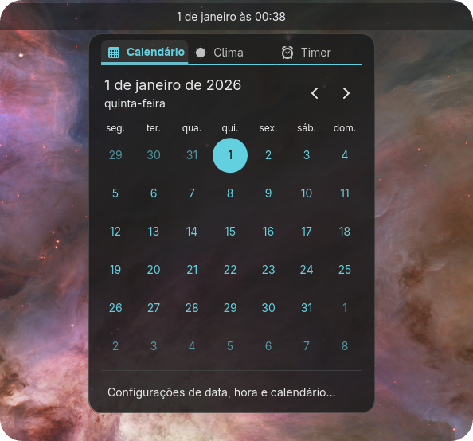
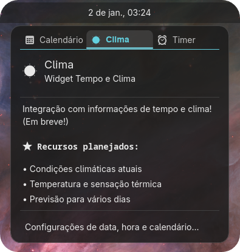
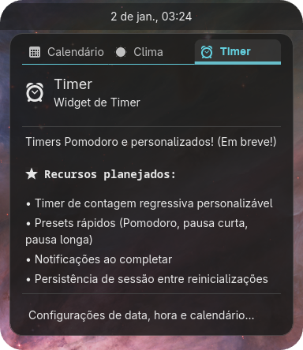

<p align="center">
  <picture>
    <source media="(prefers-color-scheme: dark)" srcset="com.system76.CosmicAppletTimePlusDark.svg">
    <source media="(prefers-color-scheme: light)" srcset="com.system76.CosmicAppletTimePlusLight.svg">
    
  </picture>
</p>

# Time Plus - Cosmic Applet

**A feature-rich time applet for [COSMIC Desktop](https://github.com/pop-os/cosmic-epoch)** that extends the default time/date/calendar functionality with integrated weather information and pomodoro timer.

<p align="center">
  
  
  
  
</p>

[🇧🇷 Leia em Português](README.pt-BR.md)

---

## 📸 Screenshots

*All screenshots captured from **v0.1.3** running on COSMIC Desktop (Fedora Linux 43)*

<details>
<summary>🔲 Tab Navigation System</summary>

<p align="center">
  
</p>

Segmented button navigation showing Calendar, Weather, and Timer tabs.
</details>

<details>
<summary>📅 Calendar Tab</summary>

<p align="center">
  
</p>

Full calendar grid with month navigation and today highlighting.
</details>

<details>
<summary>🌤️ Weather Tab (Placeholder)</summary>

<p align="center">
  
</p>

Weather module ready for API integration.
</details>

<details>
<summary>⏱️ Timer Tab (Placeholder)</summary>

<p align="center">
  
</p>

Timer module ready for countdown logic.
</details>

---

## 🎨 Visual Anatomy

The **Time Plus** design strictly follows the **Human Interface Guidelines (HIG)** of COSMIC Desktop, ensuring a native and integrated look.

### 1. Panel Integration
The part of the applet that resides permanently on the top bar.

*   **Style:** Flat button (`Button::Text`) integrated into the panel surface.
    *   *Inactive:* Transparent background, text `OnBackground`.
    *   *Active:* Highlighted background indicating open menu.
*   **Content:** Full Date and Time (e.g., "Wed, Dec 31 03:59").
    *   **Format:** Auto-detected from system locale (12h/24h).
    *   **Typography:** Inter Semi-bold, adjusted to panel height.

### 2. Main Interface (Popup)
Floating container with rounded corners (Corner Radius 12px) and standard `Surface` background.

#### A. Top Navigation (Tab System)
Located at the absolute top of the container.
*   **Component:** `segmented_button::horizontal` with `SingleSelectModel`.
*   **Style:**
    *   *Active:* Highlighted background (Accent Color), high-contrast text and icon.
    *   *Inactive:* Transparent background, gray elements (`OnSurfaceVariant`).
*   **Tabs:**
    *   📅 **Calendar:** Icon `com.system76.CosmicAppletTime-symbolic`
    *   🌤️ **Weather:** Icon `weather-clear-symbolic`
    *   ⏰ **Timer:** Icon `alarm-symbolic`

#### B. Content Area (Calendar)
*   **Header:** Prominent Month/Year (`text::Title`, size 18) and navigation controls (`button::icon`) on the right.
*   **Day Grid:**
    *   Weekdays ("Mon", "Tue"...) in smaller text (`text::Caption`).
    *   Current Day highlighted with a **Perfect Circle** filled with accent color (Cyan) and high-contrast text.

#### C. Footer
*   **Divider:** Subtle horizontal line separating content.
*   **Settings:** `menu_button` style ("Date, time & calendar settings...") filling width and reacting to hover.

---

## ✨ Features

### 🏗️ Modular Architecture
- **Separate modules** for Calendar, Weather, and Timer
- Clean separation of concerns
- Easy to extend and maintain
- Follows COSMIC applet patterns

### 📅 Calendar
- Full calendar grid with proper localization
- Month navigation with ICU formatters
- Today highlighting with accent color
- Optimized rendering with formatter caching
- Accessible via dedicated "Calendar" tab

### 🌤️ Weather *(Placeholder)*
- Modular `weather.rs` implementation
- Consistent header + content structure
- Standard COSMIC divider
- Ready for API integration
- *Coming Soon:* Current weather, forecasts, location config

### ⏱️ Timer *(Placeholder)*
- Modular `timer.rs` implementation
- Matches calendar visual consistency
- Standard COSMIC patterns
- Ready for countdown logic
- *Coming Soon:* Pomodoro presets, notifications, persistence

---

## 🆕 What's New in v0.1.3

### 🔧 Command-Line Interface
- **Debug mode**: `cosmic-applet-timeplus --debug` with structured logging
- **Custom config**: `--config <path>` for testing configurations
- Smart log filtering (`RUST_LOG`) - eliminates dependency noise

### 📊 Production-Grade Observability
- **Initialization tracing**: Panel position, locale, timezone, config snapshot
- **User interaction logs**: Categorized by `[UI]`, `[Navigation]`, `[Calendar]`, `[System]`
- **Enriched context**: Calendar operations show full dates (2026-01-21)
- **Proper log levels**: INFO for UI events, DEBUG for details, WARN for recoverable errors

### 🏗️ Architectural Improvements
- **Dependency Injection**: Configuration passed via `Flags` pattern
- **Immutable positioning**: Panel anchor captured once at init (performance)
- **Centralized validation**: Logic moved from `window.rs` to `config.rs` and `time.rs`
- **Graceful degradation**: Wayland connection errors handled without crashes

### 🐛 Fixes
- **i18n cleanup**: Removed duplicate keys from 61 language files (122 lines)
- **Error handling**: Changed Wayland errors from ERROR to WARN with context

**16 atomic commits** | See [CHANGELOG.md](CHANGELOG.md#013---2026-01-07) for full details

---

## 🏗️ Software Architecture

### Layered Architecture (v0.1.3)

Time Plus follows a clean **Layered Architecture** with clear separation of concerns introduced across v0.1.1, v0.1.2, and refined in v0.1.3:

```
┌─────────────────────────────────────────────┐
│          main.rs (Entry Point)              │
│  • CLI argument parsing (clap)              │
│  • Graceful config loading                  │
│  • Logging configuration (RUST_LOG)         │
└─────────────────────────────────────────────┘
                     │ 
                     ▼ (passes TimeAppletConfig)
┌─────────────────────────────────────────────┐
│         lib.rs (Neutral Messenger)          │
│  • Global Message enum (no dependencies)    │
│  • Tab enum shared across modules           │
│  • Prevents circular dependencies           │
│  • run(config) → cosmic::applet::run        │
└─────────────────────────────────────────────┘
                     │
                     ▼ (Flags = TimeAppletConfig)
┌─────────────────────────────────────────────┐
│         window.rs (Orchestrator)            │
│  • Dependency Injection via Flags           │
│  • Manages application lifecycle            │
│  • Handles state and messages               │
│  • Delegates ALL UI to UI Layer             │
│  • Comprehensive tracing instrumentation    │
│  • ZERO inline widgets (334 lines)          │
└─────────────────────────────────────────────┘
          │                        │
          ▼                        ▼
    [Core UI Layer]          [Features]
  ┌──────────────────┐    ┌──────────────┐
  │    panel.rs      │    │ calendar.rs  │
  │  Panel button    │    │   State      │
  │  (195 lines)     │    │   Messages   │
  └──────────────────┘    │   View       │
  ┌──────────────────┐    └──────────────┘
  │    popup.rs      │    ┌──────────────┐
  │  Popup window    │    │ weather.rs   │
  │  Tab navigation  │    │   (Ready)    │
  │  (83 lines)      │    └──────────────┘
  └──────────────────┘    ┌──────────────┐
          │               │  timer.rs    │
          ▼               │   (Ready)    │
    [Utilities]           └──────────────┘
  ┌──────────────────┐           │
  │    time.rs       │           ▼
  │  Pure formatter  │    ┌──────────────┐
  │  Timezone parse  │    │subscriptions │
  │  (84 lines)      │    │   .rs        │
  │  NO UI deps      │    └──────────────┘
  └──────────────────┘    ┌──────────────┐
  ┌──────────────────┐    │  config.rs   │
  │  localize.rs     │    │  Validation  │
  │  i18n system     │    │  methods     │
  └──────────────────┘    └──────────────┘
```


### Message Envelope Pattern

Each module has its own **isolated message system**:

```rust
// Global message envelope in lib.rs (Neutral Messenger)
pub enum Message {
    Calendar(calendar::CalendarMessage),  // Envelope for calendar
    Weather(weather::WeatherMessage),     // Envelope for weather
    Timer(timer::TimerMessage),           // Envelope for timer
    // ... only orchestration messages
}

// Module-specific messages in calendar.rs
pub enum CalendarMessage {
    SelectDay(u32),
    PreviousMonth,
    NextMonth,
}

// Module handles its own state
impl CalendarState {
    pub fn update(&mut self, msg: CalendarMessage) {
        // All calendar logic here
    }
}
```

**Benefits:**
- ✅ **Encapsulation**: Each module is self-contained
- ✅ **Maintainability**: Changes to one module don't affect others
- ✅ **Testability**: Modules can be tested independently
- ✅ **Scalability**: Easy to add new modules
- ✅ **No Circular Dependencies**: Neutral Messenger breaks dependency cycles

### Design Principles

#### 🎯 Native by Default

**The applet prioritizes COSMIC native solutions over custom implementations:**

- **Widgets**: Use `libcosmic` components (`segmented_button`, `padded_control`, etc.)
- **System APIs**: Integrate with COSMIC daemons (notifications, settings, etc.)
- **Styling**: Follow COSMIC HIG strictly (spacing, colors, typography)
- **Patterns**: Match official applets' architecture and code style

**Example:**
```rust
// ✅ GOOD: Use native COSMIC widget
let tabs = segmented_button::horizontal(&self.tab_model)
    .on_activate(Message::TabActivated);

// ❌ BAD: Custom tab implementation
let tabs = custom_tab_widget();
```

#### 🧩 Separation of Concerns (v0.1.3)

**Entry Point Layer:** *(New in v0.1.3)*
- **main.rs**: CLI parsing, graceful config loading, logging setup

**Orchestration Layer:**
- **lib.rs**: Neutral message envelope (no dependencies)
- **window.rs**: Pure orchestrator (state, messages, lifecycle ONLY) + DI via Flags

**Core UI Layer:** *(New in v0.1.2)*
- **panel.rs**: Panel button rendering (vertical/horizontal layouts)
- **popup.rs**: Popup window structure (tabs, content, footer)

**Features Layer:**
- **calendar.rs**, **weather.rs**, **timer.rs**: Domain-specific content
- Complete ownership of their domain (state + logic + view)

**Utilities Layer:**
- **time.rs**: Pure data formatting + timezone parsing (NO UI dependencies)
- **config.rs**: Configuration + centralized validation methods *(v0.1.3)*
- **subscriptions.rs**: Async subscriptions (time, timezone, wake)
- **localize.rs**: Internationalization

**No cross-module dependencies**: Modules never import each other

#### 📦 Single Responsibility (v0.1.3)

Each file has ONE clear purpose:
- `main.rs` → Entry point (CLI, config, logging) *New in v0.1.3*
- `lib.rs` → Neutral Messenger (Message + Tab enums)
- `window.rs` → Pure orchestrator (334 lines, -9% from v0.1.1) + DI *v0.1.3*
- **`panel.rs`** → Panel UI rendering (195 lines) *New in v0.1.2*
- **`popup.rs`** → Popup UI structure (83 lines) *New in v0.1.2*
- `calendar.rs` → Calendar functionality (state + view + logic)
- `time.rs` → Pure data formatting + timezone parsing (84 lines, -62% from v0.1.1)
- `config.rs` → Configuration + centralized validation *Enhanced in v0.1.3*
- `subscriptions.rs` → Subscription management (time, timezone, wake)
- `localize.rs` → Internationalization + system locale detection

---

## 🤖 Development Philosophy

This project is an experiment in **"Vibe Coding"** (Assisted Development) - a collaboration between human creativity and AI precision.

- **Human**: Thiago Cysneiros ([@defNickTCys](https://github.com/defNickTCys)) - Architecture, Design Decisions, Testing
- **AI**: Google Antigravity IDE & Claude 4.5 Sonnet - Implementation, Refactoring, Documentation

The goal is to demonstrate how advanced AI tools can accelerate modern desktop development while maintaining high standards of code quality and following strict architectural patterns.

---

## 🚀 Installation

### Prerequisites
- COSMIC Desktop Environment
- Rust toolchain (1.70+)
- libcosmic dependencies

### From Source

```bash
# Clone the repository
git clone https://github.com/defNickTCys/cosmic-applet-timeplus
cd cosmic-applet-timeplus

# Build release binary
cargo build --release

# Install to system
sudo install -Dm755 target/release/cosmic-applet-timeplus /usr/bin/cosmic-applet-timeplus
sudo install -Dm644 data/com.system76.CosmicAppletTimeplus.desktop /usr/share/applications/com.system76.CosmicAppletTimeplus.desktop
sudo install -Dm644 data/com.system76.CosmicAppletTimeplus.svg /usr/share/icons/hicolor/scalable/apps/com.system76.CosmicAppletTimeplus.svg

# Restart COSMIC panel
killall cosmic-panel
```

**Note**: For development, use `./dev.sh dev` for fast iteration without system installation.

### Adding to Panel

1. Open **COSMIC Settings**
2. Navigate to **Panel** → **Applets**
3. Find **"Time Plus"** in the list
4. Click **Add**

The applet will appear on your panel!

---

## ⚙️ Configuration

Configuration is stored in:
```
~/.config/cosmic/com.system76.CosmicAppletTimePlus/v1/
```

### Current Settings
- `show_date_in_top_panel`: Show date alongside time (default: `true`)
- `military_time`: Auto-detected from system locale
- `show_seconds`: Show seconds in time display (default: `false`)
- `first_day_of_week`: Calendar starting day (0=Sunday, 1=Monday)

---

## 🛠️ Development

### Development Script (`dev.sh`)

The project includes an optimized development script with smart Git dependency management and multiple commands for different workflows.

#### Quick Commands

```bash
# 🚀 Development (Fast iteration)
./dev.sh dev        # Debug build + install + reload (~15s, no Git updates)
./dev.sh check      # Quick code verification (no compilation)
./dev.sh test       # Run unit tests
./dev.sh clippy     # Run Rust linter

# 📦 Release
./dev.sh run        # Release build + install + reload (smart Git updates)
./dev.sh build      # Build release binary only
./dev.sh install    # Install to ~/.cargo/bin (smart Git updates)
./dev.sh reload     # Restart cosmic-panel only

# 🛠️ Utility
./dev.sh clean        # Remove build artifacts
./dev.sh force-update # Force Git dependency update
```

#### Smart Git Updates

The script automatically manages dependency updates:
- **First run of the day**: Full update with Git dependencies (~3min)
- **Subsequent runs**: Fast mode with `--locked` (~1min)
- **Manual override**: Use `force-update` to refresh dependencies

This optimization reduces development cycle time by **~60%** on subsequent builds.

#### Recommended Workflow

```bash
# Initial setup (once per day)
./dev.sh run

# Fast iteration during development
./dev.sh dev    # Make changes, test immediately

# Before committing
./dev.sh clippy # Check code quality
./dev.sh test   # Run tests
```

### Project Structure

```
cosmic-applet-timeplus/
├── src/
│   ├── main.rs          # Entry point
│   ├── lib.rs           # Neutral Messenger (Message + Tab enums)
│   ├── window.rs        # Pure Orchestrator (334 lines)
│   ├── panel.rs         # Panel UI Layer (195 lines) [v0.1.2]
│   ├── popup.rs         # Popup UI Layer (83 lines) [v0.1.2]
│   ├── config.rs        # Configuration structs
│   ├── localize.rs      # i18n system + system locale detection
│   ├── calendar.rs      # Calendar module (view + logic + state)
│   ├── time.rs          # Pure formatting utilities (84 lines)
│   ├── subscriptions.rs # Subscription management (time, timezone, wake)
│   ├── weather.rs       # Weather module (placeholder)
│   └── timer.rs         # Timer module (placeholder)
├── i18n/                # Translations (61 languages)
│   └── */cosmic_applet_timeplus.ftl
├── screenshots/         # UI screenshots
│   ├── calendar.png
│   ├── weather.png
│   └── timer.png
├── data/                # Desktop files
├── dev.sh               # Development helper script
├── create_i18n.sh       # i18n file generator
└── TRANSLATIONS.md      # Translation status
```

**Key Architectural Decisions (v0.1.3):**
- **Layered Architecture**: Clear separation between Orchestration, UI, Features, and Utilities
- **Core UI Layer**: Dedicated `panel.rs` and `popup.rs` for all UI construction (v0.1.2)
- **Pure Orchestrator**: `window.rs` has ZERO inline widgets (334 lines)
- **Pure Utilities**: `time.rs` has ZERO UI dependencies (84 lines)
- **Neutral Messenger Pattern**: `lib.rs` breaks circular dependencies
- **Modular Design**: Each tab has its own module (`calendar.rs`, `weather.rs`, `timer.rs`)
- **Subscription Isolation**: Heavy async logic in dedicated `subscriptions.rs` (166 lines)
- **No Code Duplication**: Uses `cosmic::applet::padded_control` and standard patterns
- **Consistent Structure**: All placeholders match calendar's header + content layout

### Performance Optimizations

Recent improvements include:
- **ICU Formatter Caching**: ~94% reduction in calendar rendering time
- **Consolidated Helpers**: Eliminated code duplication
- **Named Constants**: Improved code readability and maintainability


---

## 🌍 Localization

Time Plus supports **61 languages** out of the box!

**Translation Status:**
- ✅ **8 languages** fully translated (de, es-ES, fr, it, ru, ja, zh-CN, ko)
- 📝 **53 languages** using English fallback
- 🤝 **Community contributions welcome!**

📋 **See [TRANSLATIONS.md](TRANSLATIONS.md) for:**
- Complete language list with native speaker counts
- Translation guidelines
- How to contribute
- Priority languages

**Quick Translation:**
```bash
# Edit your language file
nano i18n/{language}/cosmic_applet_timeplus.ftl

# Test locally
./dev.sh dev

# Submit PR with your translation!
```

---

## 📝 Roadmap

### Phase 1: Foundation ✅
- [x] Fork cosmic-applet-time
- [x] Proper project structure
- [x] Build system and dependencies
- [x] Desktop integration
- [x] Panel display with auto-locale

### Phase 2: Tab System ✅
- [x] Implement segmented tabs (Calendar | Weather | Timer)
- [x] Extract calendar to `time.rs` module
- [x] Create `weather.rs` and `timer.rs` modules
- [x] Consistent visual style with standard COSMIC patterns
- [x] Content-driven height (no fixed dimensions)
- [x] Standard dividers with proper spacing

### Phase 2.5: Calendar Modularization ✅
- [x] Create `CalendarState` for state encapsulation
- [x] Create `CalendarMessage` enum for calendar interactions
- [x] Implement message envelope pattern (`Message::Calendar`)
- [x] Move all calendar logic to `time.rs`
- [x] Transform `window.rs` into pure orchestrator
- [x] Follow official cosmic-applet-time patterns
- [x] Zero warnings compilation

### Phase 3: Infrastructure Refactoring ✅ *v0.1.1*
- [x] **Rename** `time.rs` → `calendar.rs` (better semantic clarity)
- [x] **Move** `Message` and `Tab` enums from `window.rs` to `lib.rs` (Neutral Messenger)
- [x] **Move** `get_system_locale()` from `window.rs` to `localize.rs`
- [x] **Create** `subscriptions.rs` for heavy async logic (time, timezone, wake-from-sleep)
- [x] **Create** `time.rs` for panel formatting (`PanelFormatter`)
- [x] **Reduce** `window.rs` from 704 to 369 lines (-48%)
- [x] **Fix** APP_ID to use `com.system76.CosmicAppletTime` for config sync
- [x] **Fix** HourCycle configuration for military_time
- [x] **Fix** Real-time configuration updates (show_seconds, military_time)
- [x] **Optimize** Date format to use `MDT::medium` for better space usage

### Phase 3.8: UI Architecture & Separation ✅ *v0.1.2*
- [x] **Create** Core UI Layer (`panel.rs`, `popup.rs`)
- [x] **Extract** panel layout logic from `time.rs` to `panel.rs` (195 lines)
- [x] **Extract** popup structure from `window.rs` to `popup.rs` (83 lines)
- [x] **Purify** `time.rs` - removed ALL UI dependencies (84 lines, -62%)
- [x] **Simplify** `window.rs` - pure orchestrator (334 lines, -9%)
- [x] **Achieve** 100% separation of concerns (UI, Orchestration, Utilities, Features)
- [x] **Preserve** all visual logic (zero UI/UX changes)
- [x] **Maintain** zero compilation warnings and clippy errors

### Phase 3.6: Infrastructure Refactoring & Observability ✅ *v0.1.3*
- [x] **CLI Foundation** - `clap` with `--debug` and `--config` arguments
- [x] **Observability** - Comprehensive tracing (`[Init]`, `[UI]`, `[Navigation]`, `[Calendar]`, `[System]`)
- [x] **Dependency Injection** - Config passed via `Flags` pattern
- [x] **Centralized Logic** - Validation in `config.rs`, parsing in `time.rs`
- [x] **Immutable Positioning** - Panel anchor captured once at init
- [x] **i18n Cleanup** - Removed duplicates from 61 files
- [x] **Graceful Errors** - Wayland failures handled without crashes
- [x] **15 atomic commits** with 100% test validation

### Phase 3.7: System Wiring & Notifications 🔔 *NEXT*
- [ ] Basic notification system via `notify-rust`
- [ ] Timer countdown completion notifications
- [ ] Calendar date reminder notifications
- [ ] Notification action handlers
- [ ] Audio alerts (optional)

### Phase 4: Weather Module 🌤️
- [ ] OpenWeatherMap API integration
- [ ] Location configuration
- [ ] Weather display in popup
- [ ] Mini weather widget on panel

### Phase 5: Timer Module ⏱️
- [ ] Countdown timer logic
- [ ] Preset management
- [ ] Persistent state
- [ ] Mini timer widget on panel

### Phase 6: Quick Reminders 📝
- [ ] Date-based reminder storage
- [ ] Visual indicators on calendar
- [ ] Add/edit/delete UI
- [ ] Integration with notifications

### Phase 7: Polish 💎
- [ ] Settings UI
- [ ] Keyboard shortcuts
- [ ] Accessibility improvements

---

## 🤝 Contributing

Contributions are welcome! Please:

1. Fork the repository
2. Create a feature branch (`git checkout -b feature/amazing-feature`)
3. Commit your changes (`git commit -m 'Add amazing feature'`)
4. Push to the branch (`git push origin feature/amazing-feature`)
5. Open a Pull Request

---

## 📜 License

This project is licensed under the **GNU General Public License v3.0** - see [LICENSE](LICENSE) file for details.

Based on [cosmic-applet-time](https://github.com/pop-os/cosmic-applets) by System76.

---

## 🙏 Acknowledgments

- **Thiago Cysneiros (defNickTCys)** - Project Lead
- **Google Antigravity & Claude 3.5 Sonnet** - AI Assistance
- **System76** for COSMIC Desktop and the base time applet
- **Pop!_OS** team for libcosmic framework

---

## 📫 Support & Contact

- **Issues**: [GitHub Issues](https://github.com/defNickTCys/cosmic-applet-timeplus/issues)
- **Discussions**: [GitHub Discussions](https://github.com/defNickTCys/cosmic-applet-timeplus/discussions)

---

## 📚 Developer Documentation

- [DEVELOPMENT_STATE.md](DEVELOPMENT_STATE.md) - Current development status, learnings, and next steps

---

<p align="center">
Made with ❤️ and 🤖 for the COSMIC Desktop community
</p>

