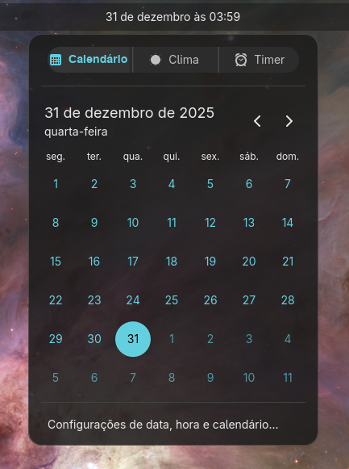

# Time Plus - Applet COSMIC

<p align="center">
  
</p>

**Um applet rico em recursos para o [COSMIC Desktop](https://github.com/pop-os/cosmic-epoch)** que estende a funcionalidade padrão de hora/data/calendário com informações meteorológicas integradas e timer pomodoro.

<p align="center">
  
  
  
  
</p>

[🇺🇸 Read in English](README.md)

---

## 🎨 Anatomia Visual

O design do **Time Plus** segue estritamente os **Human Interface Guidelines (HIG)** do COSMIC Desktop, garantindo uma aparência nativa e integrada.

### 1. Integração com o Painel
A parte do applet que reside permanentemente na barra superior.

*   **Estilo:** Botão plano (`Button::Text`) que se integra à superfíce do painel.
    *   *Inativo:* Fundo transparente, texto `OnBackground`.
    *   *Ativo:* Fundo destacado indicando menu aberto.
*   **Conteúdo:** Data e Hora completas (ex: "31 de dezembro às 03:59").
    *   **Formato:** Auto-detectado do locale do sistema (12h/24h).
    *   **Tipografia:** Inter Semi-bold, ajustada à altura do painel.

### 2. Interface Principal (Popup)
Container flutuante com cantos arredondados (Corner Radius 12px) e fundo padrão `Surface`.

#### A. Navegação de Topo (Tab System)
Localizada no topo absoluto do container.
*   **Componente:** `segmented_control::horizontal` com alternância exclusiva.
*   **Estilo:**
    *   *Ativo:* Fundo destacado (Accent Color), texto e ícone em alto contraste.
    *   *Inativo:* Fundo transparente, elementos em cinza (`OnSurfaceVariant`).
*   **Abas:**
    *   📅 **Calendário:** Ícone `com.system76.CosmicAppletTime-symbolic`
    *   🌤️ **Clima:** Ícone `weather-clear-symbolic`
    *   ⏰ **Timer:** Ícone `alarm-symbolic`

#### B. Área de Conteúdo (Calendário)
*   **Cabeçalho:** Mês/Ano em destaque (`text::Title`, tamanho 18) e controles de navegação (`button::icon`) à direita.
*   **Grade de Dias:**
    *   Dias da semana ("seg", "ter"...) em texto menor (`text::Caption`).
    *   Dia Atual destacado com **Círculo Perfeito** preenchido com a cor de destaque (Cyan) e texto em alto contraste.

#### C. Rodapé
*   **Divisor:** Linha horizontal sutil separando o conteúdo.
*   **Configurações:** Botão estilo `menu_button` ("Configurações de data, hora e calendário...") que preenche a largura e reage ao passar o mouse.

---

## ✨ Recursos

### 📅 Calendário (Padrão do Sistema)
- Grade de calendário completa com localização adequada
- Navegação por meses
- Destaque do dia atual
- Corresponde exatamente ao applet de hora padrão do COSMIC
- **Novo:** Acessível via aba dedicada "Calendário"

### 🌤️ Integração Meteorológica *(Em Progresso)*
- Acessível via aba "Clima"
- Visualização placeholder implementada
- *Em Breve:* Clima atual, previsões, configuração de localização

### ⏱️ Timer Pomodoro *(Em Progresso)*
- Acessível via aba "Timer"
- Visualização placeholder implementada
- *Em Breve:* Lógica de contagem, presets, notificações

### 📝 Lembretes Rápidos *(Em Breve)*
- Adicione lembretes simples baseados em data
- Indicadores visuais no calendário
- Notificações no desktop quando vencer

---

## 🤖 Filosofia de Desenvolvimento

Este projeto é um experimento em **"Vibe Coding"** (Desenvolvimento Assistido) - uma colaboração entre a criatividade humana e a precisão da IA.

- **Humano**: Thiago Cysneiros ([@defNickTCys](https://github.com/defNickTCys)) - Arquitetura, Decisões de Design, Testes
- **IA**: Google Antigravity IDE & Claude 4.5 Sonnet - Implementação, Refatoração, Documentação

O objetivo é demonstrar como ferramentas avançadas de IA podem acelerar o desenvolvimento de desktop moderno mantendo altos padrões de qualidade de código e seguindo padrões arquitetônicos estritos.

---

## 🚀 Instalação

### Pré-requisitos
- Ambiente COSMIC Desktop
- Rust toolchain (1.70+)
- Dependências do libcosmic

### A Partir do Código-fonte

```bash
# Clone o repositório
git clone https://github.com/defNickTCys/cosmic-applet-timeplus
cd cosmic-applet-timeplus

# Compile e instale
cargo install --path .

# Reinicie o painel COSMIC
killall cosmic-panel
```

### Adicionando ao Painel

1. Abra as **Configurações do COSMIC**
2. Navegue até **Painel** → **Miniaplicativos**
3. Encontre **"Time Plus"** na lista
4. Clique em **Adicionar**

O applet aparecerá no seu painel!

---

## ⚙️ Configuração

As configurações são armazenadas em:
```
~/.config/cosmic/com.system76.CosmicAppletTimePlus/v1/
```

### Configurações Atuais
- `show_date_in_top_panel`: Mostrar data junto com hora (padrão: `true`)
- `military_time`: Auto-detectado do locale do sistema
- `show_seconds`: Mostrar segundos na exibição de hora (padrão: `false`)
- `first_day_of_week`: Dia inicial do calendário (0=Domingo, 1=Segunda)

---

## 🛠️ Desenvolvimento

### Script de Desenvolvimento (`dev.sh`)

O projeto inclui um script de desenvolvimento otimizado com gerenciamento inteligente de dependências Git e múltiplos comandos para diferentes fluxos de trabalho.

#### Comandos Rápidos

```bash
# 🚀 Desenvolvimento (Iteração rápida)
./dev.sh dev        # Build debug + instalar + recarregar (~15s, sem updates Git)
./dev.sh check      # Verificação rápida de código (sem compilação)
./dev.sh test       # Executar testes unitários
./dev.sh clippy     # Executar linter Rust

# 📦 Release
./dev.sh run        # Build release + instalar + recarregar (updates Git inteligentes)
./dev.sh build      # Apenas compilar binário release
./dev.sh install    # Instalar em ~/.cargo/bin (updates Git inteligentes)
./dev.sh reload     # Apenas reiniciar cosmic-panel

# 🛠️ Utilidades
./dev.sh clean        # Remover artifacts de build
./dev.sh force-update # Forçar atualização de dependências Git
```

#### Updates Git Inteligentes

O script gerencia automaticamente as atualizações de dependências:
- **Primeira execução do dia**: Atualização completa com dependências Git (~3min)
- **Execuções subsequentes**: Modo rápido com `--locked` (~1min)
- **Override manual**: Use `force-update` para atualizar dependências

Esta otimização reduz o tempo do ciclo de desenvolvimento em **~60%** em builds subsequentes.

#### Fluxo de Trabalho Recomendado

```bash
# Configuração inicial (uma vez por dia)
./dev.sh run

# Iteração rápida durante desenvolvimento
./dev.sh dev    # Faça mudanças, teste imediatamente

# Antes de commitar
./dev.sh clippy # Verificar qualidade do código
./dev.sh test   # Executar testes
```

### Estrutura do Projeto

```
cosmic-applet-timeplus/
├── src/
│   ├── main.rs       # Ponto de entrada
│   ├── lib.rs        # Declarações de módulos
│   ├── window.rs     # Lógica principal (Abas e Views)
│   ├── config.rs     # Structs de configuração
│   ├── localize.rs   # Sistema i18n
│   ├── time.rs       # Renderização de calendário e helpers
│   ├── weather.rs    # Módulo de clima (stub)
│   └── timer.rs      # Módulo de timer (stub)
├── i18n/             # Traduções (61 idiomas)
├── data/             # Arquivos desktop
└── dev.sh            # Script helper de desenvolvimento
```

### Otimizações de Performance

Melhorias recentes incluem:
- **Cache de Formatadores ICU**: ~94% de redução no tempo de renderização do calendário
- **Helpers Consolidados**: Eliminação de duplicação de código
- **Constantes Nomeadas**: Melhor legibilidade e manutenibilidade do código

### Adicionando Recursos

O applet é construído sobre a base do `cosmic-applet-time` oficial, garantindo compatibilidade e seguindo padrões de design do COSMIC.

**Para estender:**
1. Adicione novos módulos em `src/`
2. Atualize o enum `Message` em `window.rs`
3. Implemente funções de visualização
4. Adicione traduções em `i18n/`


---

## 🌍 Localização

Time Plus suporta **61 idiomas** prontos para uso, usando o mesmo sistema de localização do applet de hora oficial do COSMIC.

As traduções estão em formato Fluent (arquivos `.ftl`) sob `i18n/`.

Para adicionar ou atualizar traduções:
```bash
# Edite o arquivo do idioma apropriado
nano i18n/pt-BR/cosmic_applet_timeplus.ftl

# Recompile e teste
./dev.sh run
```

---

## 📝 Roadmap

### Fase 1: Fundação ✅
- [x] Fork do cosmic-applet-time
- [x] Estrutura adequada do projeto
- [x] Sistema de build e dependências
- [x] Integração com desktop
- [x] Exibição no painel com auto-locale

### Fase 2: Sistema de Abas 🚧
- [/] Implementar abas segmentadas (Calendário | Clima | Timer) (Bugs visuais menores)
- [x] Extrair calendário para visualização dedicada
- [/] Estilo visual consistente (Ícones + Texto) (Precisa de refinamento)
- [x] Garantir altura consistente entre abas

### Fase 3: Módulo de Clima 📍
- [ ] Integração com API OpenWeatherMap
- [ ] Configuração de localização
- [ ] Exibição de clima no popup
- [ ] Mini widget de clima no painel

### Fase 4: Módulo de Timer ⏱️
- [ ] Lógica de timer de contagem regressiva
- [ ] Gerenciamento de presets
- [ ] Notificações no desktop
- [ ] Mini widget de timer no painel

### Fase 5: Lembretes Rápidos 📝
- [ ] Armazenamento de lembretes baseados em data
- [ ] Indicadores visuais no calendário
- [ ] Interface adicionar/editar/excluir
- [ ] Notificações desktop quando vencer
- [ ] Auto-limpeza de lembretes antigos

### Fase 6: Refinamento 💎
- [ ] Interface de configurações
- [ ] Atalhos de teclado
- [ ] Melhorias de acessibilidade
- [ ] Otimização de performance

---

## 🤝 Contribuindo

Contribuições são bem-vindas! Por favor:

1. Faça um fork do repositório
2. Crie uma branch de feature (`git checkout -b feature/recurso-incrivel`)
3. Commit suas mudanças (`git commit -m 'Adiciona recurso incrível'`)
4. Push para a branch (`git push origin feature/recurso-incrivel`)
5. Abra um Pull Request

### Estilo de Código
- Siga a formatação padrão do Rust (`cargo fmt`)
- Execute verificações do clippy (`cargo clippy`)
- Garanta que builds passem (`cargo build --release`)
- Teste em ambiente COSMIC real

---

## 📜 Licença

Este projeto está licenciado sob a **GNU General Public License v3.0** - veja o arquivo [LICENSE](LICENSE) para detalhes.

Baseado no [cosmic-applet-time](https://github.com/pop-os/cosmic-applets) da System76.

---

## 🙏 Agradecimentos

- **Thiago Cysneiros (defNickTCys)** - Líder do Projeto
- **Google Antigravity & Claude 3.5 Sonnet** - Assistência via IA
- **System76** pelo COSMIC Desktop e o applet de hora base
- Time **Pop!_OS** pelo framework libcosmic

---

## 📫 Suporte & Contato

- **Issues**: [GitHub Issues](https://github.com/defNickTCys/cosmic-applet-timeplus/issues)
- **Discussões**: [GitHub Discussions](https://github.com/defNickTCys/cosmic-applet-timeplus/discussions)

---

<p align="center">
Feito com ❤️ e 🤖 para a comunidade COSMIC Desktop
</p>
