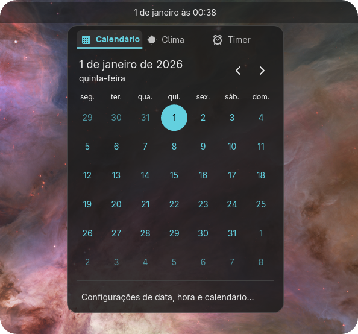
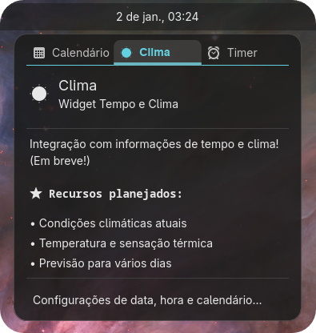
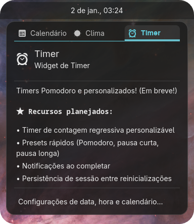

<p align="center">
  <picture>
    <source media="(prefers-color-scheme: dark)" srcset="com.system76.CosmicAppletTimePlusDark.svg">
    <source media="(prefers-color-scheme: light)" srcset="com.system76.CosmicAppletTimePlusLight.svg">
    
  </picture>
</p>

# Time Plus - Applet COSMIC

**Um applet rico em recursos para o [COSMIC Desktop](https://github.com/pop-os/cosmic-epoch)** que estende a funcionalidade padrão de hora/data/calendário com informações meteorológicas integradas e timer pomodoro.

<p align="center">
  
  
  
  
</p>

[🇺🇸 Read in English](README.md)

---

## 📸 Capturas de Tela

*Todas as capturas de tela da **v0.1.1** executando no COSMIC Desktop (Fedora Linux 43)*

<details>
<summary>🔲 Sistema de Navegação por Abas</summary>

<p align="center">
  
</p>

Navegação com botões segmentados mostrando abas Calendário, Clima e Timer.
</details>

<details>
<summary>📅 Aba Calendário</summary>

<p align="center">
  
</p>

Grade de calendário completa com navegação por mês e destaque do dia atual.
</details>

<details>
<summary>🌤️ Aba Clima (Placeholder)</summary>

<p align="center">
  
</p>

Módulo de clima pronto para integração de API.
</details>

<details>
<summary>⏱️ Aba Timer (Placeholder)</summary>

<p align="center">
  
</p>

Módulo de timer pronto para lógica de contagem.
</details>

---

## 🎨 Anatomia Visual

O design do **Time Plus** segue estritamente os **Human Interface Guidelines (HIG)** do COSMIC Desktop, garantindo uma aparência nativa e integrada.

### 1. Integração com o Painel
A parte do applet que reside permanentemente na barra superior.

*   **Estilo:** Botão plano (`Button::Text`) que se integra à superfíce do painel.
    *   *Inativo:* Fundo transparente, texto `OnBackground`.
    *   *Ativo:* Fundo destacado indicando menu aberto.
*   **Conteúdo:** Data e Hora completas (ex: "31 de dezembro às 03:59").
    *   **Formato:** Auto-detectado do locale do sistema (12h/24h).
    *   **Tipografia:** Inter Semi-bold, ajustada à altura do painel.

### 2. Interface Principal (Popup)
Container flutuante com cantos arredondados (Corner Radius 12px) e fundo padrão `Surface`.

#### A. Navegação de Topo (Tab System)
Localizada no topo absoluto do container.
*   **Componente:** `segmented_button::horizontal` com `SingleSelectModel`.
*   **Estilo:**
    *   *Ativo:* Fundo destacado (Accent Color), texto e ícone em alto contraste.
    *   *Inativo:* Fundo transparente, elementos em cinza (`OnSurfaceVariant`).
*   **Abas:**
    *   📅 **Calendário:** Ícone `com.system76.CosmicAppletTime-symbolic`
    *   🌤️ **Clima:** Ícone `weather-clear-symbolic`
    *   ⏰ **Timer:** Ícone `alarm-symbolic`

#### B. Área de Conteúdo (Calendário)
*   **Cabeçalho:** Mês/Ano em destaque (`text::Title`, tamanho 18) e controles de navegação (`button::icon`) à direita.
*   **Grade de Dias:**
    *   Dias da semana ("seg", "ter"...) em texto menor (`text::Caption`).
    *   Dia Atual destacado com **Círculo Perfeito** preenchido com a cor de destaque (Cyan) e texto em alto contraste.

#### C. Rodapé
*   **Divisor:** Linha horizontal sutil separando o conteúdo.
*   **Configurações:** Botão estilo `menu_button` ("Configurações de data, hora e calendário...") que preenche a largura e reage ao passar o mouse.

---

## ✨ Recursos

### 🏗️ Arquitetura Modular
- **Módulos separados** para Calendário, Clima e Timer
- Separação clara de responsabilidades
- Fácil de estender e manter
- Segue padrões de applets COSMIC

### 📅 Calendário
- Grade de calendário completa com localização adequada
- Navegação por meses com formatadores ICU
- Destaque do dia atual com cor de destaque
- Renderização otimizada com cache de formatadores
- Acessível via aba dedicada "Calendário"

### 🌤️ Clima *(Placeholder)*
- Implementação modular em `weather.rs`
- Estrutura consistente de cabeçalho + conteúdo
- Divisor padrão COSMIC
- Pronto para integração de API
- *Em Breve:* Clima atual, previsões, configuração de localização

### ⏱️ Timer *(Placeholder)*
- Implementação modular em `timer.rs`
- Consistência visual com calendário
- Padrões COSMIC padrão
- Pronto para lógica de contagem
- *Em Breve:* Presets Pomodoro, notificações, persistência

---

## 🏗️ Arquitetura de Software

### Padrão Mensageiro Neutro + Orquestrador

O Time Plus segue uma arquitetura limpa de **Mensageiro Neutro + Orquestrador + Módulos Especialistas** introduzida na v0.1.1:

```mermaind
graph TD
    %% Estilos de Cores
    classDef neutral fill:#2d333b,stroke:#adbac7,color:#adbac7,stroke-width:2px;
    classDef orchestrator fill:#1e4273,stroke:#58a6ff,color:#fff,stroke-width:4px;
    classDef module fill:#238636,stroke:#2ea043,color:#fff;
    classDef logic fill:#d29922,stroke:#e3b341,color:#000;

    subgraph "Infraestrutura Base"
        LIB(lib.rs<br/>Mensageiro Neutro):::neutral
    end

    subgraph "Entrada de Eventos"
        SUB(subscriptions.rs<br/>Sensores do Sistema):::logic
    end

    subgraph "Lógica Principal"
        WIN(window.rs<br/>Orquestrador):::orchestrator
    end

    subgraph "Módulos Especialistas"
        CAL(calendar.rs<br/>Calendário):::module
        WEA(weather.rs<br/>Clima):::module
        TIM(timer.rs<br/>Timer):::module
    end

    subgraph "Utilitários Compartilhados"
        TIME(time.rs<br/>Formatador do Painel):::logic
    end

    %% Fluxo de Dados
    SUB -->|Emite Message| WIN
    WIN -->|Delega View| CAL
    WIN -->|Delega View| WEA
    WIN -->|Delega View| TIM
    WIN -->|Usa| TIME

    %% Relação com o Mensageiro (Tipos)
    CAL -.->|Referencia Tipos| LIB
    WEA -.->|Referencia Tipos| LIB
    TIM -.->|Referencia Tipos| LIB
    WIN -.->|Referencia Tipos| LIB
    TIME -.->|Referencia Tipos| LIB
```

### Padrão de Envelope de Mensagens

Cada módulo possui seu próprio **sistema de mensagens isolado**:

```rust
// Envelope de mensagens globais em lib.rs (Mensageiro Neutro)
pub enum Message {
    Calendar(calendar::CalendarMessage),  // Envelope para calendário
    Weather(weather::WeatherMessage),     // Envelope para clima
    Timer(timer::TimerMessage),           // Envelope para timer
    // ... apenas mensagens de orquestração
}

// Mensagens específicas do módulo em calendar.rs
pub enum CalendarMessage {
    SelectDay(u32),
    PreviousMonth,
    NextMonth,
}

// Módulo gerencia seu próprio estado
impl CalendarState {
    pub fn update(&mut self, msg: CalendarMessage) {
        // Toda a lógica do calendário aqui
    }
}
```

**Benefícios:**
- ✅ **Encapsulamento**: Cada módulo é auto-contido
- ✅ **Manutenibilidade**: Mudanças em um módulo não afetam outros
- ✅ **Testabilidade**: Módulos podem ser testados independentemente
- ✅ **Escalabilidade**: Fácil adicionar novos módulos
- ✅ **Sem Dependências Circulares**: Mensageiro Neutro quebra ciclos de dependência

### Princípios de Design

#### 🎯 Nativo por Padrão

**O applet prioriza soluções nativas do COSMIC ao invés de implementações customizadas:**

- **Widgets**: Usar componentes `libcosmic` (`segmented_button`, `padded_control`, etc.)
- **APIs do Sistema**: Integrar com daemons do COSMIC (notificações, configurações, etc.)
- **Estilização**: Seguir COSMIC HIG estritamente (espaçamento, cores, tipografia)
- **Padrões**: Corresponder à arquitetura e estilo de código dos applets oficiais

**Exemplo:**
```rust
// ✅ BOM: Usar widget nativo do COSMIC
let tabs = segmented_button::horizontal(&self.tab_model)
    .on_activate(Message::TabActivated);

// ❌ RUIM: Implementação customizada de abas
let tabs = custom_tab_widget();
```

#### 🧩 Separação de Responsabilidades

- **lib.rs**: Envelope de mensagens neutro (sem dependências)
- **window.rs**: Gerenciamento de janela + orquestração de abas APENAS
- **Módulos**: Propriedade completa de seu domínio (estado + lógica + view)
- **subscriptions.rs**: Lógica assíncrona pesada (tempo, timezone, wake-from-sleep)
- **time.rs**: Formatação de tempo do painel (PanelFormatter)
- **Sem dependências entre módulos**: Módulos nunca importam uns aos outros

#### 📦 Responsabilidade Única

Cada arquivo tem UM propósito claro:
- `lib.rs` → Mensageiro Neutro (enums Message + Tab)
- `window.rs` → Orquestração da janela popup (369 linhas, -48% da v0.1.0)
- `calendar.rs` → Funcionalidade do calendário (estado + view + lógica)
- `time.rs` → Formatação de tempo do painel (PanelFormatter)
- `subscriptions.rs` → Gerenciamento de subscriptions (tick tempo, timezone, wake-from-sleep)
- `config.rs` → Gerenciamento de configuração
- `localize.rs` → Internacionalização + detecção de locale do sistema

---

## 🤖 Filosofia de Desenvolvimento

Este projeto é um experimento em **"Vibe Coding"** (Desenvolvimento Assistido) - uma colaboração entre a criatividade humana e a precisão da IA.

- **Humano**: Thiago Cysneiros ([@defNickTCys](https://github.com/defNickTCys)) - Arquitetura, Decisões de Design, Testes
- **IA**: Google Antigravity IDE & Claude 4.5 Sonnet - Implementação, Refatoração, Documentação

O objetivo é demonstrar como ferramentas avançadas de IA podem acelerar o desenvolvimento de desktop moderno mantendo altos padrões de qualidade de código e seguindo padrões arquitetônicos estritos.

---

## 🚀 Instalação

### Pré-requisitos
- Ambiente COSMIC Desktop
- Rust toolchain (1.70+)
- Dependências do libcosmic

### A Partir do Código-fonte

```bash
# Clone o repositório
git clone https://github.com/defNickTCys/cosmic-applet-timeplus
cd cosmic-applet-timeplus

# Compile o binário release
cargo build --release

# Instale no sistema
sudo install -Dm755 target/release/cosmic-applet-timeplus /usr/bin/cosmic-applet-timeplus
sudo install -Dm644 data/com.system76.CosmicAppletTimeplus.desktop /usr/share/applications/com.system76.CosmicAppletTimeplus.desktop
sudo install -Dm644 data/com.system76.CosmicAppletTimeplus.svg /usr/share/icons/hicolor/scalable/apps/com.system76.CosmicAppletTimeplus.svg

# Reinicie o painel COSMIC
killall cosmic-panel
```

**Nota**: Para desenvolvimento, use `./dev.sh dev` para iteração rápida sem instalação no sistema.

### Adicionando ao Painel

1. Abra as **Configurações do COSMIC**
2. Navegue até **Painel** → **Miniaplicativos**
3. Encontre **"Time Plus"** na lista
4. Clique em **Adicionar**

O applet aparecerá no seu painel!

---

## ⚙️ Configuração

As configurações são armazenadas em:
```
~/.config/cosmic/com.system76.CosmicAppletTimePlus/v1/
```

### Configurações Atuais
- `show_date_in_top_panel`: Mostrar data junto com hora (padrão: `true`)
- `military_time`: Auto-detectado do locale do sistema
- `show_seconds`: Mostrar segundos na exibição de hora (padrão: `false`)
- `first_day_of_week`: Dia inicial do calendário (0=Domingo, 1=Segunda)

---

## 🛠️ Desenvolvimento

### Script de Desenvolvimento (`dev.sh`)

O projeto inclui um script de desenvolvimento otimizado com gerenciamento inteligente de dependências Git e múltiplos comandos para diferentes fluxos de trabalho.

#### Comandos Rápidos

```bash
# 🚀 Desenvolvimento (Iteração rápida)
./dev.sh dev        # Build debug + instalar + recarregar (~15s, sem updates Git)
./dev.sh check      # Verificação rápida de código (sem compilação)
./dev.sh test       # Executar testes unitários
./dev.sh clippy     # Executar linter Rust

# 📦 Release
./dev.sh run        # Build release + instalar + recarregar (updates Git inteligentes)
./dev.sh build      # Apenas compilar binário release
./dev.sh install    # Instalar em ~/.cargo/bin (updates Git inteligentes)
./dev.sh reload     # Apenas reiniciar cosmic-panel

# 🛠️ Utilidades
./dev.sh clean        # Remover artifacts de build
./dev.sh force-update # Forçar atualização de dependências Git
```

#### Updates Git Inteligentes

O script gerencia automaticamente as atualizações de dependências:
- **Primeira execução do dia**: Atualização completa com dependências Git (~3min)
- **Execuções subsequentes**: Modo rápido com `--locked` (~1min)
- **Override manual**: Use `force-update` para atualizar dependências

Esta otimização reduz o tempo do ciclo de desenvolvimento em **~60%** em builds subsequentes.

#### Fluxo de Trabalho Recomendado

```bash
# Configuração inicial (uma vez por dia)
./dev.sh run

# Iteração rápida durante desenvolvimento
./dev.sh dev    # Faça mudanças, teste imediatamente

# Antes de commitar
./dev.sh clippy # Verificar qualidade do código
./dev.sh test   # Executar testes
```

### Estrutura do Projeto

```
cosmic-applet-timeplus/
├── src/
│   ├── main.rs          # Ponto de entrada
│   ├── lib.rs           # Mensageiro Neutro (Message + Tab enums)
│   ├── window.rs        # Orquestrador (369 linhas, -48% da v0.1.0)
│   ├── config.rs        # Structs de configuração
│   ├── localize.rs      # Sistema i18n + detecção de locale do sistema
│   ├── calendar.rs      # Módulo calendário (view + lógica + estado)
│   ├── time.rs          # Formatação de tempo do painel (PanelFormatter)
│   ├── subscriptions.rs # Gerenciamento de subscriptions (tempo, timezone, wake)
│   ├── weather.rs       # Módulo clima (placeholder)
│   └── timer.rs         # Módulo timer (placeholder)
├── i18n/                # Traduções (61 idiomas)
│   └── */cosmic_applet_timeplus.ftl
├── screenshots/         # Capturas de tela da UI
│   ├── calendar.png
│   ├── weather.png
│   └── timer.png
├── data/                # Arquivos desktop
├── dev.sh               # Script helper de desenvolvimento
├── create_i18n.sh       # Gerador de arquivos i18n
└── TRANSLATIONS.md      # Status de traduções
```

**Decisões Arquiteturais Chave (v0.1.1):**
- **Padrão Mensageiro Neutro**: `lib.rs` quebra dependências circulares
- **Design Modular**: Cada aba tem seu próprio módulo (`calendar.rs`, `weather.rs`, `timer.rs`)
- **Separação de Responsabilidades**: `window.rs` orquestra (369 linhas), módulos implementam
- **Isolamento de Subscriptions**: Lógica assíncrona pesada em `subscriptions.rs` dedicado (166 linhas)
- **Formatação de Painel**: `time.rs` dedicado com `PanelFormatter` (222 linhas)
- **Sem Duplicação de Código**: Usa `cosmic::applet::padded_control` e padrões padrão
- **Estrutura Consistente**: Todos os placeholders seguem o layout cabeçalho + conteúdo do calendário

### Otimizações de Performance

Melhorias recentes incluem:
- **Cache de Formatadores ICU**: ~94% de redução no tempo de renderização do calendário
- **Helpers Consolidados**: Eliminação de duplicação de código
- **Constantes Nomeadas**: Melhor legibilidade e manutenibilidade do código

### Adicionando Recursos

O applet é construído sobre a base do `cosmic-applet-time` oficial, garantindo compatibilidade e seguindo padrões de design do COSMIC.

**Para estender:**
1. Adicione novos módulos em `src/`
2. Atualize o enum `Message` em `window.rs`
3. Implemente funções de visualização
4. Adicione traduções em `i18n/`


---

## 🌍 Localização

Time Plus suporta **61 idiomas** prontos para uso, usando o mesmo sistema de localização do applet de hora oficial do COSMIC.

As traduções estão em formato Fluent (arquivos `.ftl`) sob `i18n/`.

Para adicionar ou atualizar traduções:
```bash
# Edite o arquivo do idioma apropriado
nano i18n/pt-BR/cosmic_applet_timeplus.ftl

# Recompile e teste
./dev.sh run
```

---

## 📝 Roadmap

### Fase 1: Fundação ✅
- [x] Fork do cosmic-applet-time
- [x] Estrutura adequada do projeto
- [x] Sistema de build e dependências
- [x] Integração com desktop
- [x] Exibição no painel com auto-locale

### Fase 2: Sistema de Abas ✅
- [x] Implementar abas segmentadas (Calendário | Clima | Timer)
- [x] Extrair calendário para módulo `time.rs`
- [x] Criar módulos `weather.rs` e `timer.rs`
- [x] Estilo visual consistente com padrões COSMIC padrão
- [x] Altura definida pelo conteúdo (sem dimensões fixas)
- [x] Divisores padrão com espaçamento adequado

### Fase 2.5: Modularização do Calendário ✅
- [x] Criar `CalendarState` para encapsulamento de estado
- [x] Criar enum `CalendarMessage` para interações do calendário
- [x] Implementar padrão de envelope de mensagens (`Message::Calendar`)
- [x] Mover toda lógica do calendário para `time.rs`
- [x] Transformar `window.rs` em orquestrador puro
- [x] Seguir padrões do cosmic-applet-time oficial
- [x] Compilação sem warnings

### Fase 3: Refatoração de Infraestrutura ✅ *v0.1.1*
- [x] **Renomear** `time.rs` → `calendar.rs` (melhor clareza semântica)
- [x] **Mover** enums `Message` e `Tab` de `window.rs` para `lib.rs` (Mensageiro Neutro)
- [x] **Mover** `get_system_locale()` de `window.rs` para `localize.rs`
- [x] **Criar** `subscriptions.rs` para lógica assíncrona pesada (tempo, timezone, wake-from-sleep)
- [x] **Criar** `time.rs` para formatação de painel (`PanelFormatter`)
- [x] **Reduzir** `window.rs` de 704 para 369 linhas (-48%)
- [x] **Corrigir** APP_ID para usar `com.system76.CosmicAppletTime` para sincronização de config
- [x] **Corrigir** configuração de HourCycle para military_time
- [x] **Corrigir** atualizações de configuração em tempo real (show_seconds, military_time)
- [x] **Otimizar** formato de data para usar `MDT::medium` para melhor aproveitamento de espaço

### Fase 4: Módulo de Clima 🌤️ *PRÓXIMA*
- [ ] Integração com API OpenWeatherMap
- [ ] Configuração de localização
- [ ] Exibição de clima no popup
- [ ] Mini widget de clima no painel

### Fase 5: Módulo de Timer ⏱️
- [ ] Lógica de timer de contagem regressiva
- [ ] Gerenciamento de presets
- [ ] Notificações no desktop
- [ ] Mini widget de timer no painel

### Fase 6: Lembretes Rápidos 📝
- [ ] Armazenamento de lembretes baseados em data
- [ ] Indicadores visuais no calendário
- [ ] Interface adicionar/editar/excluir
- [ ] Notificações desktop quando vencer

### Fase 7: Refinamento 💎
- [ ] Interface de configurações
- [ ] Atalhos de teclado
- [ ] Melhorias de acessibilidade

---

## 🤝 Contribuindo

Contribuições são bem-vindas! Por favor:

1. Faça um fork do repositório
2. Crie uma branch de feature (`git checkout -b feature/recurso-incrivel`)
3. Commit suas mudanças (`git commit -m 'Adiciona recurso incrível'`)
4. Push para a branch (`git push origin feature/recurso-incrivel`)
5. Abra um Pull Request

### Estilo de Código
- Siga a formatação padrão do Rust (`cargo fmt`)
- Execute verificações do clippy (`cargo clippy`)
- Garanta que builds passem (`cargo build --release`)
- Teste em ambiente COSMIC real

---

## 📜 Licença

Este projeto está licenciado sob a **GNU General Public License v3.0** - veja o arquivo [LICENSE](LICENSE) para detalhes.

Baseado no [cosmic-applet-time](https://github.com/pop-os/cosmic-applets) da System76.

---

## 🙏 Agradecimentos

- **Dio Linux** por me convecer da aventura de vir pro mundo Linux!
- **Google Antigravity & Claude 3.5 Sonnet** - Assistência via IA
- **System76** pelo COSMIC Desktop e o applet de hora base
- Time **Pop!_OS** pelo framework libcosmic

---

## 📫 Suporte & Contato

- **Issues**: [GitHub Issues](https://github.com/defNickTCys/cosmic-applet-timeplus/issues)
- **Discussões**: [GitHub Discussions](https://github.com/defNickTCys/cosmic-applet-timeplus/discussions)

---

<p align="center">
Feito com ❤️ e 🤖 para a comunidade COSMIC Desktop
</p>
